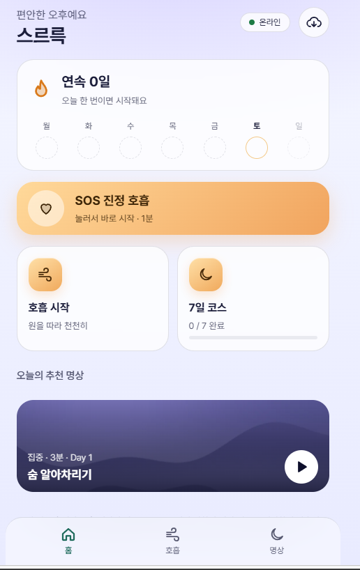
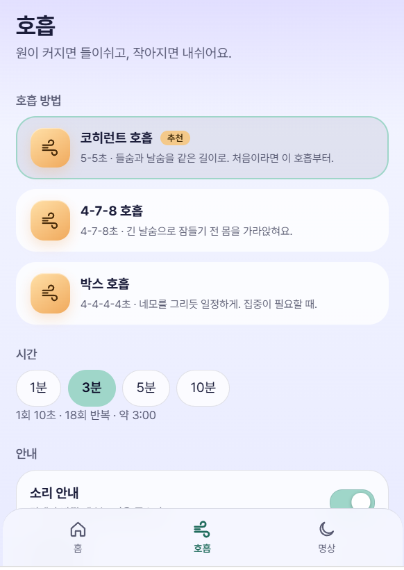
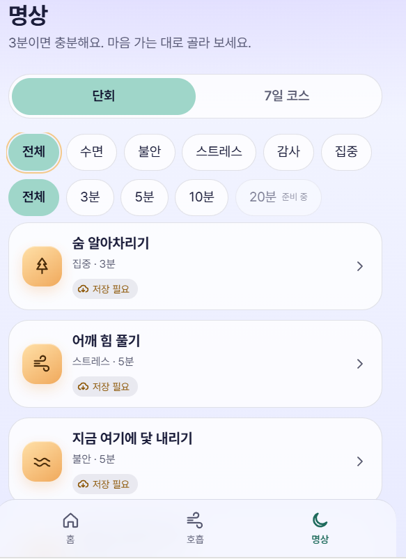

<p align="center">
  
  
  
</p>

# 스르륵 — 호흡과 명상 앱

비행기 모드에서도 켜지는, 호흡과 명상으로 스르륵 긴장을 푸는 웹앱(PWA).
HTML + CSS + 바닐라 JS(ES Modules), 빌드 도구·서버·DB 없음. 기록은 기기 안(localStorage)에만 저장됩니다.

## 이번 작업 요약 (MVP v1.0, 2026-10-03)

기술명세서(`seureureuk-mvp-tech-spec.md`)를 기준으로 서버·DB 없는 정적 PWA를 처음부터 구현했습니다.

**구현한 것**
- **화면 5개**: 홈(연속일수·주간 체크·SOS), 호흡, 명상(필터·7일 코스), 전체 화면 플레이어, 오프라인 준비
- **호흡**: 코히런트·4-7-8·박스·SOS 프리셋, 1/3/5/10분, `performance.now()` 기준 타이밍, 일시정지, 소리·진동 안내, 동작 줄이기 대응
- **명상**: 주제·길이 필터(20분은 "준비 중"), 7일 코스 순차 해제, 80% 재생 시 완료, 이어 듣기, 배경 영상(실패 시 이미지로 대체)
- **오프라인**: 서비스 워커 + Cache API. 앱 기본 파일은 자동 저장, 영상·소리·음성은 선택 저장. iOS용 Range(206) 응답 포함
- **에셋(약 23MB)**: 이미지·영상·호흡 안내음·아이콘은 코드로 직접 생성, 가이드 명상 7개는 직접 쓴 원고 + TTS, Pretendard 폰트 내장

**검증 결과**
- 단위 테스트 9개 통과(`node --test`)
- Edge 자동화 점검: 전체 저장 → 오프라인 전환 → 새로고침 → 저장한 명상 재생·구간 이동 → Day 1 완료·연속 1일 → 미저장 명상은 재생 불가 안내, 모두 정상
- 콘솔 오류·실패 요청 없음

**작업 중 고친 문제**
- 노을 배경 이미지의 해 부분이 지나치게 밝아 빛 세기를 낮춤
- 플레이어를 닫은 뒤 늦게 도착하는 오디오 오류 이벤트가 안내 문구를 다시 띄우던 문제 → 닫힌 플레이어의 이벤트는 무시하도록 수정
- 사용하지 않는 import 정리
- (자동화 점검 스크립트의 선택자 문제 2건은 앱이 아닌 테스트 쪽 오류여서 스크립트만 수정)

**알려진 한계 / 배포 전 할 일**
- 가이드 음성은 Windows TTS로 만든 **임시본**입니다. 상업적 이용 조건이 불명확하므로 배포 전 교체하세요(`assets/LICENSES.md` 참고).
- `sound/` 배경 소리(15초 반복)의 출처 확인과 더 긴 소리로의 교체를 권장합니다.
- iPhone 실기기에서 오프라인 재생·구간 이동은 아직 검증하지 못했습니다.

## 실행

Service Worker는 `file://`로는 동작하지 않으니 로컬 서버로 여세요. **이 폴더(`sseureureuk/`)가 사이트 루트**여야 합니다(경로가 `/`로 시작).

```bash
npx serve .              # http://localhost:3000
# 또는 VS Code Live Server: index.html 우클릭 → Open with Live Server (이 폴더를 작업공간 루트로)
```

## 오프라인 테스트
1. 온라인 상태로 앱을 열고 → 홈 우측 상단 구름 아이콘 → **오프라인 준비** → `전체 저장하기`
2. 모든 항목이 `저장됨 ✓`이 되면 DevTools → Network → **Offline** (또는 기기를 비행기 모드로)
3. 앱을 완전히 닫았다가 다시 열기 → 호흡·저장한 명상·영상 배경이 동작하면 성공
4. iPhone은 Safari **공유 → 홈 화면에 추가** 후 설치된 앱으로 반복(오디오·영상 스크러빙 포함)

날짜를 바꿔 연속일수를 확인하려면 주소에 `?today=2026-10-05`를 붙이세요.

## 파일을 바꿨다면
```bash
python tools/build_media.py      # data/media.json(저장 목록·크기) 갱신
```
그리고 `sw.js` 맨 위의 `APP_CACHE`(`app-v1` → `app-v2`) 버전을 올려야 사용자 기기의 저장본이 새로 바뀝니다.

## 구조
```
index.html · styles.css · app.js(라우터) · sw.js · manifest.webmanifest
js/   breathing · meditation · progress · offline · offline-view · audio · device · home · storage · ui
data/ sessions.json · breathing-presets.json · media.json(자동 생성)
assets/ audio{guides,ambient,cues} · video · images · icons · fonts · LICENSES.md
tools/  make_assets.py(이미지·영상·안내음·아이콘) · make_voice.py + narration.py(가이드 음성) · build_media.py
tests/  progress.test.mjs   →  node --test
```

## 에셋 다시 만들기
```bash
pip install numpy pillow imageio-ffmpeg
python tools/make_assets.py all     # 이미지·영상·호흡 안내음·아이콘
python tools/make_voice.py          # 가이드 음성 (Windows 한국어 TTS 사용, 임시용)
python tools/build_media.py
```

## 배포 (GitHub → Vercel)
저장소에 올린 뒤 Vercel에서 *Add New Project* → Framework Preset **Other**, 빌드 명령 없음.
이 폴더가 저장소의 하위 폴더라면 **Root Directory**를 `sseureureuk`으로 지정하세요.
**배포 전 `assets/LICENSES.md`의 "교체 필요" 항목(가이드 음성)을 먼저 처리하세요.**

## 의료 고지
이 앱은 휴식과 호흡·명상 습관을 돕는 도구이며 질환의 진단·치료를 대신하지 않습니다.
